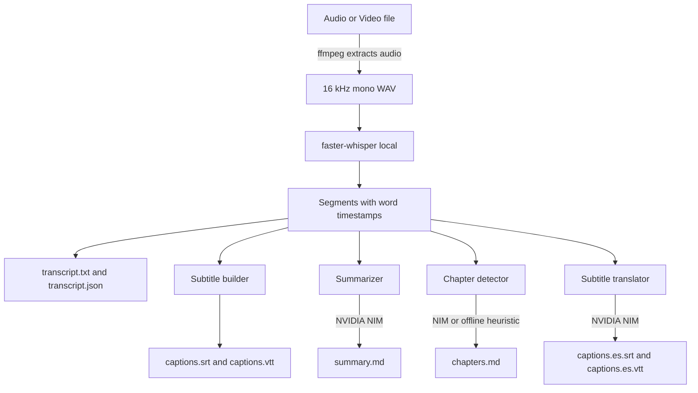

# transcribe-studio

**Turn any audio or video into a transcript, summary, chapters and subtitles.** Local [faster-whisper](https://github.com/SYSTRAN/faster-whisper) does the transcription on your own machine; free [NVIDIA NIM](https://build.nvidia.com) writes the summaries, chapters and translations. Batch-friendly and Spanish-ready.


---

## Why

Most transcription tools make you pick a side: cheap-but-private local Whisper that gives you a raw wall of text, or a paid cloud API that also summarizes but ships your audio somewhere. transcribe-studio takes the good half of each.

- **Transcription stays local.** Your audio never leaves the machine. faster-whisper runs int8 on CPU or float16 on your GPU.
- **The language work is free.** Summaries, YouTube-style chapters and subtitle translation run on NVIDIA NIM's free tier — no credit card, just a `nvapi-` key.
- **You get artifacts, not a blob.** One command turns a file into `transcript.txt`, `captions.srt`, `captions.vtt`, `summary.md` and `chapters.md`.
- **It scales to a folder.** Point it at a directory and it processes every file, isolating failures so one bad file doesn't sink the run.

Everything degrades gracefully: with no API key you still get a full transcript, both subtitle formats, and offline heuristic chapters. The key only unlocks the LLM-powered extras.

## Architecture



Local steps are on the left path; the three NIM-powered steps are clearly separated so it is obvious what needs a key and what does not.

## Quickstart

```bash
git clone https://github.com/AleBrito124356/transcribe-studio.git
cd transcribe-studio

python -m venv .venv && source .venv/bin/activate      # Windows: .venv\Scripts\activate
pip install -r requirements.txt

cp .env.example .env      # then paste your NVIDIA NIM key (optional but recommended)
```

**ffmpeg is required** for decoding audio and pulling the track out of video files:

```bash
# macOS
brew install ffmpeg
# Ubuntu / Debian
sudo apt install ffmpeg
# Windows
winget install Gyan.FFmpeg
```

**Get a free NIM key** (starts with `nvapi-`) in about two minutes at [build.nvidia.com](https://build.nvidia.com) — no credit card. Put it in `.env`:

```
NVIDIA_API_KEY=nvapi-XXXXXXXXXXXXXXXXXXXXXXXX
```

## Usage

The whole pipeline in one command:

```bash
python cli.py all episode.mp3 -o results/
```

```
Language: en  |  Duration: 2847.0s
Wrote results/transcript.txt
Wrote results/transcript.json
Wrote results/captions.srt
Wrote results/captions.vtt
Wrote results/summary.md
Wrote results/chapters.md
```

Individual stages when you only want one thing:

```bash
# Just a transcript, small model, forced Spanish, with rough speaker labels
python cli.py transcribe entrevista.mp4 --model small --lang es --diarize -o out/

# Subtitles for a video, plus a translated Spanish track
python cli.py subs talk.mp4 --translate es -o out/

# Summarize an existing transcript without re-running Whisper
python cli.py summarize out/transcript.json --summary-lang en

# Chapters straight from a saved transcript, offline heuristic only
python cli.py chapters out/transcript.json --local
```

**Batch a whole folder** — one subfolder of artifacts per file, plus a `batch_report.md`:

```bash
python cli.py all ./podcast_backlog/ -o results/
```

```
results/
├── batch_report.md
├── ep01/  (transcript.txt, captions.srt, captions.vtt, summary.md, chapters.md, transcript.json)
├── ep02/  ...
└── ep03/  ...
```

Expected `chapters.md` sketch:

```
# Chapters

00:00 Intro and guest background
04:12 Why local transcription matters
11:48 Handling long recordings
23:30 Subtitles and reading speed
35:05 Q and A
```

## Model size vs speed and accuracy

faster-whisper size passed via `--model`. Times are rough, for one hour of audio; VRAM is the GPU figure at float16. On CPU everything runs at int8, which is slower but needs no GPU.

| Model        | Params | VRAM (fp16) | Rel. speed | Accuracy      | Good for                       |
|--------------|--------|-------------|------------|---------------|--------------------------------|
| `tiny`       | 39 M   | ~1 GB       | ~32x       | rough         | quick drafts, keyword spotting |
| `base`       | 74 M   | ~1 GB       | ~16x       | decent        | default, clean English audio   |
| `small`      | 244 M  | ~2 GB       | ~6x        | good          | podcasts, meetings             |
| `medium`     | 769 M  | ~5 GB       | ~2x        | very good     | accents, some noise            |
| `large-v3`   | 1550 M | ~10 GB      | ~1x        | best          | final captions, hard audio     |
| `distil-large-v3` | 756 M | ~6 GB  | ~4x        | near large-v3 | best quality-per-second        |

Rule of thumb: start at `base`, jump to `small` or `medium` if names and jargon come out wrong, and reach for `large-v3` / `distil-large-v3` when captions are going public.

### GPU note (RTX 5070 and other NVIDIA cards)

The default is CPU int8 so it works everywhere. To use your GPU:

```bash
python cli.py all lecture.mp4 --device cuda --compute-type float16 -o results/
```

On an RTX 5070 (12 GB) `large-v3` fits comfortably at `float16`; use `int8_float16` if you want to run it alongside other GPU work. GPU acceleration needs a CUDA-enabled CTranslate2 build plus a recent CUDA 12.x runtime and cuDNN — see the [faster-whisper GPU docs](https://github.com/SYSTRAN/faster-whisper#gpu). If a CUDA/cuDNN library is missing, drop `--device cuda` and it falls back to CPU.

## Use cases

- **Podcasts** — transcript for SEO, a TL;DR for the show notes, and paste-ready chapter timestamps for the description.
- **Meetings** — searchable transcript, key points and a checklist of action items in `summary.md`.
- **Online courses / lectures** — burn subtitles from the SRT, add chapters so students can jump to a topic.
- **YouTube** — upload `captions.vtt`, drop the chapters into the description, translate subtitles into a second language for reach.

## Quickstart en espanol

transcribe-studio detecta espanol automaticamente y puede resumir y crear capitulos en espanol.

```bash
# Transcribir una entrevista en espanol y traducir los subtitulos al ingles
python cli.py all entrevista.mp3 --lang es --summary-lang es --translate en -o resultados/
```

Genera `transcript.txt`, `captions.srt`, `captions.vtt`, `summary.md` y `chapters.md` con el resumen en espanol, mas una pista de subtitulos `captions.en.srt` traducida al ingles. Sin clave de NIM igual obtienes la transcripcion, ambos formatos de subtitulos y los capitulos por heuristica local.

## Speaker labels (diarization)

`--diarize` adds approximate `Speaker 1` / `Speaker 2` labels by detecting pauses between segments. It is a heuristic, not real diarization: it cannot tell voices apart or count speakers, and it says so at the top of the transcript. For accurate results, install [pyannote.audio](https://github.com/pyannote/pyannote-audio) and use the `diarize_pyannote` hook in `src/diarize.py`.

## Project structure

```
transcribe-studio/
├── cli.py                 # transcribe | subs | summarize | chapters | all
├── src/
│   ├── config.py          # dataclasses, time formatting, .env loader, JSON IO
│   ├── nim.py             # tiny OpenAI-compatible NVIDIA NIM client (stdlib only)
│   ├── transcribe.py      # faster-whisper, ffmpeg extraction, long-file chunking
│   ├── subtitles.py       # SRT/VTT with wrapping, reading-speed timing, translation
│   ├── summarize.py       # TL;DR, summary, key points, actions; chunk-and-reduce
│   ├── chapters.py        # topic-shift detection, local heuristic or NIM
│   ├── diarize.py         # silence-gap speaker heuristic + pyannote hook
│   └── pipeline.py        # single-file and batch orchestration
├── tests/                 # 50 tests, whisper and NIM mocked
├── requirements.txt
├── pyproject.toml
├── .env.example
└── LICENSE
```

## How it works, briefly

- **Long files** are cut into overlapping windows with ffmpeg and their timestamps are stitched back together, so a two-hour recording never has to fit in memory at once (`chunk_boundaries` in `transcribe.py`).
- **Subtitles** wrap to a max line width, split over-long segments into several cues with time allocated in proportion to characters, and enforce a reading-speed floor so no caption flashes by faster than a human can read — while never overlapping the next cue.
- **Summaries** map-and-reduce: long transcripts are summarized chunk by chunk, then those partial summaries are summarized together.
- **Chapters** compare the vocabulary before and after each candidate boundary (a TextTiling-style approach) and mark a chapter where the topic shifts or a long silence occurs. With a NIM key, the model writes nicer titles.

## Running the tests

```bash
pip install pytest
pytest -q
```

The suite mocks faster-whisper and NIM, so it runs offline in well under a second and covers the timing math, subtitle formatting, chunk boundaries, chapter detection and the full pipeline wiring.

## Related projects

Part of a family of small, free-tier AI tools by the same author:

- **[voice-agent-starter](https://github.com/AleBrito124356/voice-agent-starter)** — Local voice assistant built on the same whisper + NIM stack, plus edge-tts for speech out.
- **[recetas-ia](https://github.com/AleBrito124356/recetas-ia)** — Recetas de IA en espanol con NVIDIA NIM gratis; same free-tier approach, Spanish-first.
- **[nim-free-api-quickstarts](https://github.com/AleBrito124356/nim-free-api-quickstarts)** — Minimal quickstarts for every free NVIDIA NIM capability, if you want to build your own.
- **[nim-agent-lab](https://github.com/AleBrito124356/nim-agent-lab)** — 12 AI agent patterns in pure Python on free NVIDIA NIM.

## License

MIT © 2026 Alejandro Brito. See [LICENSE](LICENSE).
