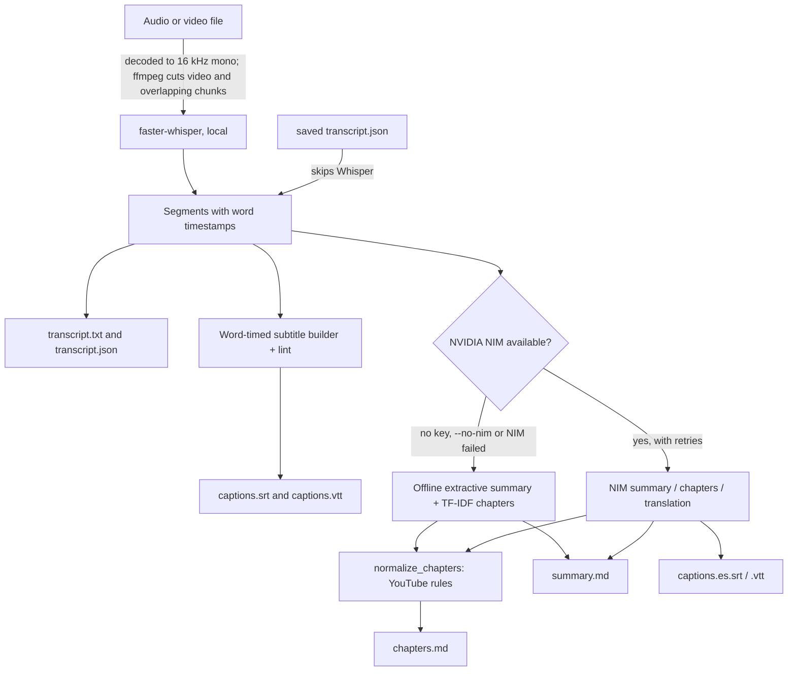

# transcribe-studio

**Turn any audio or video into a transcript, subtitles, a summary and YouTube chapters.** Local [faster-whisper](https://github.com/SYSTRAN/faster-whisper) does the transcription on your own machine. Free [NVIDIA NIM](https://build.nvidia.com) writes nicer summaries, chapter titles and translations when you have a key. Without one, everything still works offline. Batch-friendly and Spanish-ready.


---

## Try it in 10 seconds (offline, nothing to install)

The repo ships a small saved transcript, [`examples/sample-podcast.transcript.json`](examples/): a 3:40 bilingual episode with two speakers, backups in English and then balcony tomatoes in Spanish. Every command except `transcribe` accepts a `transcript.json`, which skips Whisper entirely. So with plain Python and no packages at all:

```bash
git clone https://github.com/AleBrito124356/transcribe-studio.git
cd transcribe-studio
python cli.py all examples/sample-podcast.transcript.json --no-nim -o demo/
```

```
Language: en  |  Duration: 219.8s
Wrote demo/transcript.txt
Wrote demo/transcript.json
Wrote demo/captions.srt
Wrote demo/captions.vtt
Wrote demo/summary.md
Wrote demo/chapters.md
Captions: 46 cues | 0 overlaps | 0 above 17 chars/s (max 16.0) | 0 lines over 42 chars
```

`demo/chapters.md` finds the switch to the Spanish segment and titles it in Spanish:

```
# Chapters

00:00 Backups Home Fix
00:44 Snapshots Restore Storage
02:02 Abono Balcón Tomates
```

`demo/summary.md` is an offline extractive summary. It is labelled as one, and its action items come from both languages:

```
## Action items

- [ ] We need to test a restore from the offsite copy every month, a full restore to a spare disk, not just listing files.
- [ ] Let's schedule the first restore test for Saturday morning.
- [ ] I'll write the retention policy and the restore steps in the wiki tonight.
- [ ] Make sure the restore checklist includes opening a few photos and a database dump by hand.
- [ ] Hay que regar temprano por la mañana, antes de que el sol caliente las macetas.
- [ ] Tenemos que comprar más abono esta semana.
- [ ] Y no te olvides de poner tutores a cada planta, porque con el viento del balcón los tallos se doblan.
```

Add `--diarize --speaker-labels` to get `[Speaker 1]` / `<v Speaker 1>` tagged captions. Real media needs the install below; the first transcription downloads the Whisper model you choose from Hugging Face (`base` is about 145 MB).

## Why

Most transcription tools make you pick a side: cheap-but-private local Whisper that gives you a raw wall of text, or a paid cloud API that also summarizes but ships your audio somewhere. transcribe-studio takes the good half of each.

- **Transcription stays local.** Your audio never leaves the machine. faster-whisper runs int8 on CPU or float16 on your GPU.
- **The language work is free, and optional.** With a free `nvapi-` key, NVIDIA NIM writes the summary, chapter titles and subtitle translations. Without one you still get all five artifacts: the summary becomes an offline extractive one and chapters come from an offline TF-IDF detector.
- **You get artifacts, not a blob.** One command turns a file into `transcript.txt`, `transcript.json`, `captions.srt`, `captions.vtt`, `summary.md` and `chapters.md`, plus a `manifest.json` describing the run.
- **It degrades gracefully.** A missing key, a revoked key, a network outage or the free tier's rate limit never aborts a run. NIM calls are retried with backoff, and a failing step becomes a warning with an offline fallback. The CLI prints a short error message with a distinct exit code, never a traceback (unless you ask for one with `--debug`).
- **It scales to a folder.** Point it at a directory and it processes every file with one model load. Failures stay isolated to their file, same-named files never overwrite each other, and `--skip-existing` resumes an interrupted batch.

## Architecture



## Quickstart

```bash
git clone https://github.com/AleBrito124356/transcribe-studio.git
cd transcribe-studio

python -m venv .venv && source .venv/bin/activate      # Windows: .venv\Scripts\activate
pip install -r requirements.txt          # or: pip install .   (adds the `transcribe-studio` command)

cp .env.example .env      # then paste your NVIDIA NIM key (optional)
```

`pip install .` installs a single namespaced package, `transcribe_studio`, with a `transcribe-studio` console script. `python -m transcribe_studio ...` and, from a clone, `python cli.py ...` are the same CLI.

**ffmpeg is required** for decoding audio and pulling the track out of video files:

```bash
# macOS
brew install ffmpeg
# Ubuntu / Debian
sudo apt install ffmpeg
# Windows
winget install Gyan.FFmpeg
```

**Get a free NIM key** (starts with `nvapi-`) in about two minutes at [build.nvidia.com](https://build.nvidia.com), no credit card needed. Put it in `.env`:

```
NVIDIA_API_KEY=nvapi-XXXXXXXXXXXXXXXXXXXXXXXX
```

Every setting in `.env` (`NIM_MODEL`, `NIM_BASE_URL` for a self-hosted or other OpenAI-compatible gateway, `NIM_MAX_RETRIES`, `NIM_TIMEOUT`) is read when a client is created, so it applies to every command.

## Usage

The whole pipeline in one command:

```bash
python cli.py all episode.mp3 -o results/
```

Example output for a 47-minute episode (the first line is a live progress line on a terminal):

```
  transcribing 12:31 / 47:27 (26%)
Language: en  |  Duration: 2847.0s
Wrote results/transcript.txt
Wrote results/transcript.json
Wrote results/captions.srt
Wrote results/captions.vtt
Wrote results/summary.md
Wrote results/chapters.md
Captions: 812 cues | 0 overlaps | 9 above 17 chars/s (max 21.4) | 0 lines over 42 chars
```

Individual stages, when you only want one thing:

```bash
# Just a transcript, small model, forced Spanish, with rough speaker labels
python cli.py transcribe entrevista.mp4 --model small --lang es --diarize -o out/

# Subtitles for a video, plus a translated Spanish track (needs NIM)
python cli.py subs talk.mp4 --translate es -o out/

# Re-cut captions from a saved (maybe hand-corrected) transcript, 32-char lines, speaker tags
python cli.py subs out/transcript.json --max-chars 32 --speaker-labels -o out/

# Summarize without re-running Whisper (.json, .txt or media). --local = offline extractive
python cli.py summarize out/transcript.json --summary-lang en
python cli.py summarize notes.txt --local

# Chapters straight from a saved transcript, offline detector only
python cli.py chapters out/transcript.json --local

# Regenerate every artifact from a transcript: no Whisper, no model download
python cli.py all out/transcript.json --no-nim -o out2/
```

### Batch a whole folder

```bash
python cli.py all ./podcast_backlog/ -o results/
python cli.py all ./podcast_backlog/ -o results/ --skip-existing    # resume after an interruption
```

```
[1/3] ep01.mp3: ok, 6 files in results/ep01
[2/3] ep01.wav: ok, 6 files in results/ep01-wav
[3/3] ep02.mp3: FAILED: MediaDecodeError: could not decode audio from ep02.mp3: Invalid data found ...
Batch complete: 2/3 succeeded. Report in results/batch_report.md
```

```
results/
├── batch_report.md        # per file: status, language, duration, caption lint, warnings
├── ep01/                  # transcript.txt/.json, captions.srt/.vtt, summary.md, chapters.md, manifest.json
├── ep01-wav/              # same stem as ep01.mp3, so it gets its own folder instead of overwriting
└── ep02/
```

The Whisper model loads once, on the first file that needs it. `manifest.json` is written last in every folder, and `--skip-existing` skips a file only when its manifest names the same file with the same size and every listed output still exists. If NIM rejects the key partway through, NIM is switched off for the rest of the batch instead of failing on every file.

### What you get

| File | Contents |
|------|----------|
| `transcript.txt` | Readable paragraphs, or `Speaker N:` dialogue when the transcript has speakers |
| `transcript.json` | Segments with word timestamps (and speakers after `--diarize`); input for every other command |
| `captions.srt` / `captions.vtt` | Word-timed cues, balanced two-line layout, valid escaped WebVTT, optional speaker tags |
| `summary.md` | NIM: TL;DR, overview, key points, action items. Offline: the same sections, quoted from the transcript and labelled as extractive |
| `chapters.md` | Paste-ready `MM:SS Title` lines that follow YouTube's rules |
| `captions.<lang>.srt/.vtt` | With `--translate <lang>` and a NIM key; timestamps preserved |
| `manifest.json` | Source name/size, options, outputs, warnings, caption lint; the resume marker |

### Exit codes

| Code | Meaning |
|------|---------|
| 0 | Success (NIM problems during `all` are warnings, not failures) |
| 1 | Some files in a batch failed, or an unexpected error (re-run with `--debug` for the traceback) |
| 2 | Usage problem: bad arguments, a `.json` given to `transcribe`, a `.txt` given to `all`, or `--translate` without a key |
| 3 | ffmpeg is not installed |
| 4 | Input file not found |
| 5 | NIM rejected the key, kept rate-limiting, or was unreachable (for `summarize` / `subs --translate`) |
| 6 | faster-whisper is not installed, or the Whisper model could not be loaded (for example offline on first use) |
| 7 | The input could not be decoded (ffmpeg or faster-whisper's decoder) |
| 8 | A `.json` that is not a transcript this tool can read |

## Model size vs speed and accuracy

faster-whisper size passed via `--model` (or a local model directory). Times are rough, for one hour of audio; VRAM is the GPU figure at float16. On CPU everything runs at int8, which is slower but needs no GPU.

| Model        | Params | VRAM (fp16) | Rel. speed | Accuracy      | Good for                       |
|--------------|--------|-------------|------------|---------------|--------------------------------|
| `tiny`       | 39 M   | ~1 GB       | ~32x       | rough         | quick drafts, keyword spotting |
| `base`       | 74 M   | ~1 GB       | ~16x       | decent        | default, clean English audio   |
| `small`      | 244 M  | ~2 GB       | ~6x        | good          | podcasts, meetings             |
| `medium`     | 769 M  | ~5 GB       | ~2x        | very good     | accents, some noise            |
| `large-v3`   | 1550 M | ~10 GB      | ~1x        | best          | final captions, hard audio     |
| `distil-large-v3` | 756 M | ~6 GB  | ~4x        | near large-v3 | best quality-per-second        |

Rule of thumb: start at `base`, jump to `small` or `medium` if names and jargon come out wrong, and reach for `large-v3` / `distil-large-v3` when captions are going public.

### GPU note (RTX 5070 and other NVIDIA cards)

The default is CPU int8 so it works everywhere. To use your GPU:

```bash
python cli.py all lecture.mp4 --device cuda --compute-type float16 -o results/
```

On an RTX 5070 (12 GB) `large-v3` fits comfortably at `float16`; use `int8_float16` if you want to run it alongside other GPU work. GPU acceleration needs a CUDA-enabled CTranslate2 build plus a recent CUDA 12.x runtime and cuDNN; see the [faster-whisper GPU docs](https://github.com/SYSTRAN/faster-whisper#gpu). If a CUDA/cuDNN library is missing, the CLI reports it in a short error message instead of a traceback; drop `--device cuda` to run on CPU.

### Long recordings

```bash
python cli.py all two-hour-panel.mp4 --chunk-length 600 --chunk-overlap 4 -o results/
```

`--chunk-length` decodes the file in ffmpeg-cut windows that really overlap by `--chunk-overlap` seconds (default 2). Each window keeps only the speech that starts between the midpoints of its overlaps. A segment that straddles a cut is split with its word timestamps, so no word is lost or transcribed twice. When the language is auto-detected, the language found in the first window is locked in for the rest, so one noisy window can't switch the transcript to another language halfway through.

## Use cases

- **Podcasts**: a transcript for SEO, a TL;DR for the show notes, and paste-ready chapter timestamps for the description.
- **Meetings**: a searchable transcript, key points and a checklist of action items in `summary.md`, even offline.
- **Online courses / lectures**: burn subtitles from the SRT, and add chapters so students can jump to a topic.
- **YouTube**: upload `captions.vtt`, drop the chapters into the description (always 00:00 first, at least 10 s apart), and translate subtitles into a second language for reach.

## Quickstart en español

transcribe-studio detecta el español automáticamente y puede resumir y crear capítulos en español.

```bash
# Transcribir una entrevista en español y traducir los subtítulos al inglés
python cli.py all entrevista.mp3 --lang es --summary-lang es --translate en -o resultados/
```

Genera `transcript.txt`, `captions.srt`, `captions.vtt`, `summary.md` y `chapters.md`, con el resumen en español y una pista de subtítulos `captions.en.srt` traducida al inglés. Sin clave de NIM obtienes igualmente la transcripción, los dos formatos de subtítulos, capítulos locales y un resumen extractivo sin conexión. Las palabras vacías y muletillas en español ("también", "o sea", "bueno", "entonces") se ignoran aunque lleven tilde, y los títulos conservan sus acentos ("Balcón", "Café"). Los puntos de acción se detectan también en español ("hay que…", "tenemos que…", "no te olvides de…").

## Speaker labels (diarization)

`--diarize` adds approximate `Speaker 1` / `Speaker 2` labels by detecting pauses between segments. The labels are written to `transcript.txt` and saved in `transcript.json`, so anything rebuilt from it later keeps them. `--speaker-labels` (on `subs` and `all`) carries them into the captions: `[Speaker 2]` at each change of speaker in SRT, and standard `<v Speaker 2>` voice tags on every cue in VTT. If the transcript has no speakers yet, the pause heuristic is used and the CLI says so. It is a heuristic, not real diarization: it cannot tell voices apart or count speakers, and it says so at the top of the transcript. For accurate results, install [pyannote.audio](https://github.com/pyannote/pyannote-audio) and use the `diarize_pyannote` hook in `transcribe_studio/diarize.py`.

## Project structure

```
transcribe-studio/
├── cli.py                     # source-checkout shim: python cli.py <command>
├── transcribe_studio/
│   ├── cli.py                 # transcribe | subs | summarize | chapters | all (the transcribe-studio command)
│   ├── __main__.py            # python -m transcribe_studio
│   ├── config.py              # dataclasses, time formatting, .env loader, transcript JSON IO
│   ├── nim.py                 # stdlib OpenAI-compatible NIM client: retries, backoff, Retry-After
│   ├── transcribe.py          # faster-whisper, ffmpeg extraction, overlapping chunks, progress
│   ├── subtitles.py           # word-timed SRT/VTT cues, layout, escaping, speakers, lint, translation
│   ├── summarize.py           # NIM TL;DR, summary, key points, actions; chunk-and-reduce
│   ├── extractive.py          # offline extractive summary (TF-IDF + TextRank, bilingual actions)
│   ├── chapters.py            # TF-IDF topic shifts, distinctive titles, YouTube normalisation, NIM
│   ├── diarize.py             # silence-gap speaker heuristic + pyannote hook
│   └── pipeline.py            # single-file and batch orchestration, manifest, resume
├── examples/                  # sample-podcast.transcript.json and how to use it
├── tests/                     # 192 tests; whisper and NIM faked, ffmpeg/HTTP/CLI real
├── CHANGELOG.md
├── requirements.txt
├── pyproject.toml
├── .env.example
└── LICENSE
```

## How it works, briefly

- **Long files** are cut with ffmpeg into windows that overlap. Ownership changes at the middle of each overlap, and straddling segments are split on word timestamps. The timestamps are stitched back together, so a two-hour recording never has to fit in memory at once (`chunk_boundaries` / `keep_between` in `transcribe.py`).
- **Subtitles** are built from Whisper's word timestamps: each cue starts on its first word and ends on its last. A cue breaks when it would exceed the line width or 7 seconds, preferring sentence ends, pauses of at least 0.5 s and clause punctuation, and it always breaks across silences of 1 s or more. Two-line cues are balanced, prefer breaking at sentence and clause boundaries or before a conjunction, and avoid leaving an article or preposition dangling at a line end. A reading-speed floor keeps cues up long enough to read without ever overlapping the next one, and every file gets a lint line (overlaps, characters per second, line width). Text without word timings (translations, older transcripts) falls back to character-proportional timing. VTT text is escaped (`&`, `<`, `>`, and therefore `-->`), and SRT turns a literal `-->` into `->`.
- **Summaries**: with NIM, long transcripts are summarized chunk by chunk and the partial summaries are then combined (map-reduce). Offline, sentences are ranked with TF-IDF TextRank. The most central one is the TL;DR, the top ones in original order form the overview, and action items come from English and Spanish commitment phrases ("we need to", "I'll", "hay que", "tenemos que"…), ignoring framing such as "let's talk about".
- **Chapters**: the vocabulary before and after every candidate point is compared as TF-IDF vectors (a TextTiling-style approach). The IDF is computed over the whole recording, so words said all the time (the show's name, "podcast", verbal tics) count for nothing. The strongest shifts and long silences become boundaries. Titles are the words most distinctive of each chapter, in their original casing, never repeated. NIM chapters and local ones both go through the same YouTube rules: 00:00 first, nothing past the end, at least 10 s per chapter, and at least three chapters when the media is long enough.
- **NIM** calls go through a small stdlib client. It retries HTTP 408/429/5xx, timeouts and dropped connections with exponential backoff and jitter, honouring `Retry-After`. A rejected key or unknown model fails fast with a message that says what to fix.

## Running the tests

```bash
pip install -r requirements.txt      # pytest + faster-whisper (imported lazily; tests never load a model)
pytest -q                            # 192 tests, about 15-25 s
pytest -q -m "not slow"              # skip real ffmpeg/subprocess/socket/wheel work: about 2 s
```

Nothing touches the network or downloads a model: Whisper is replaced by a fake model and NIM by fakes or a local `http.server`. The suite covers:

- the NIM client against a real local HTTP server: 429 with `Retry-After`, 5xx backoff, 401/403/404, non-JSON answers, a closed port, and `.env` loaded after import;
- `transcribe()` on real media generated with ffmpeg (a 70 s WAV, an MP4), checking that chunked audio loses and duplicates nothing and that the language is locked;
- word-timed captions, including 40 seeded random transcripts through strict SRT/VTT parsers;
- TF-IDF chapters and YouTube normalisation, including 5,000 segments in under 2 s;
- the extractive summary on a bilingual fixture;
- the pipeline's fallbacks, batch naming, resume and manifest;
- the real CLI end to end on the sample with faster-whisper made unimportable, including exit codes and error messages;
- a wheel build that must contain only `transcribe_studio/`.

The ffmpeg tests skip when ffmpeg is missing, and the wheel test skips without `setuptools>=77` (`pip install -e ".[dev]"` brings it).

## Related projects

Part of a family of small, free-tier AI tools by the same author:

- **[voice-agent-starter](https://github.com/AleBrito124356/voice-agent-starter)**: a local voice assistant built on the same whisper + NIM stack, plus edge-tts for speech out.
- **[recetas-ia](https://github.com/AleBrito124356/recetas-ia)**: AI recipes in Spanish on free NVIDIA NIM; the same free-tier approach, Spanish-first.
- **[nim-free-api-quickstarts](https://github.com/AleBrito124356/nim-free-api-quickstarts)**: minimal quickstarts for every free NVIDIA NIM capability, if you want to build your own.
- **[nim-agent-lab](https://github.com/AleBrito124356/nim-agent-lab)**: 12 AI agent patterns in pure Python on free NVIDIA NIM.

## License

MIT © 2026 Alejandro Brito. See [LICENSE](LICENSE). Changes are listed in [CHANGELOG.md](CHANGELOG.md).
